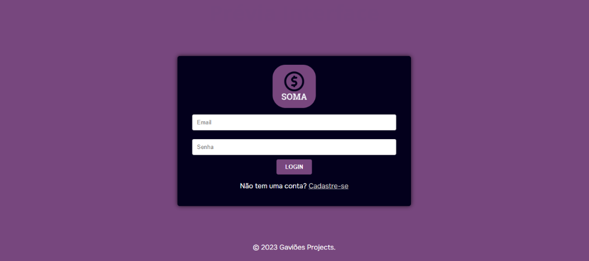
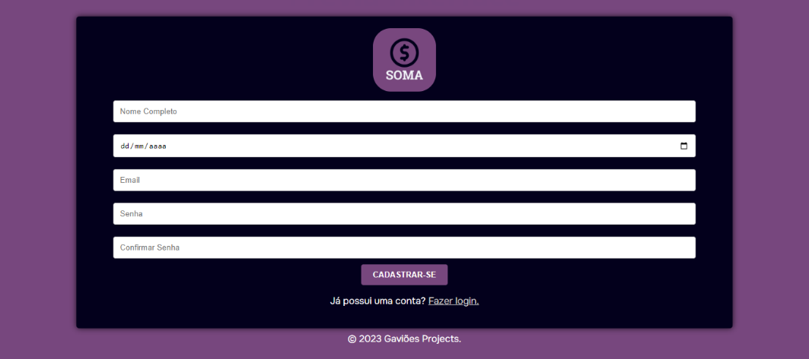
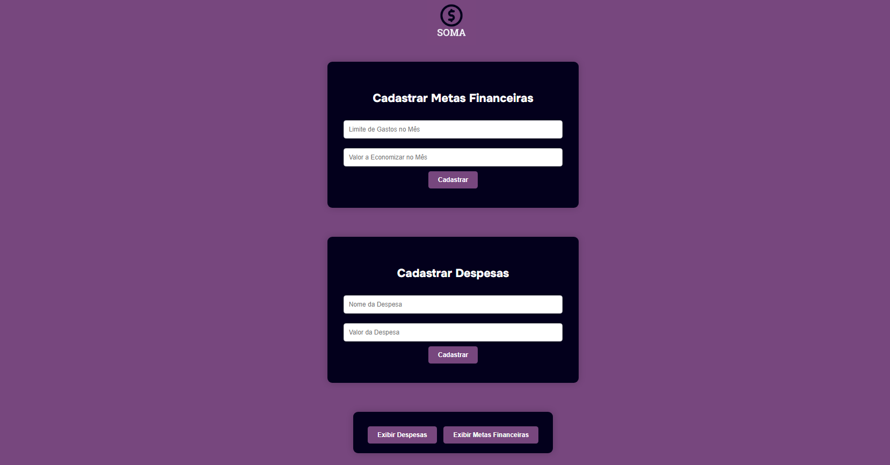

# Soma - Planejador Financeiro
## Versão: 1.0 
## Status do Projeto: ⚠️ Espera

## Tópicos
🔹 Descrição do projeto 

🔹 Funcionalidades

🔹 Distribuição

🔹 Pré-requisitos

🔹 Como rodar a aplicação

🔹 Testes realizados

🔹 Linguagens, dependências e libs utilizadas

🔹 Recursos inseridos 

🔹 Desenvolvedores/Contribuintes

🔹 Informações Extras

...

## Descrição do projeto
Nosso projeto visa criar um Planner Financeiro interativo e aliado a gamificação, usando Javascript, HTML e CSS. Os usuários poderão definir metas financeiras, acompanhar despesas e receber recompensas ao atingirem objetivos financeiros, tornando a gestão financeira mais eficaz e envolvente, utilizando da tecnologia para promover mais engajamento e educação financeira de forma lúdica.

## Funcionalidades ⚙️
✔️ Gestão financeira simples;

✔️ Organização;

✔️ Interface fácil de ser utilizada;

✔️ Gamificação.

## Distribuição
Projeto ainda em desenvolvimento.

## Pré-requisitos ⚠️    
- Windows 11
- Máquina de Testes = I3 - 9100F / Geforce GTX1650 / 16RAM / 512GBSSD

## Como rodar a aplicação 
Projeto pode ser acessado através de qualquer navegador.

## Testes realizados

### Testes:
- USUÁRIO NÃO PREENCHE NADA NO CAMPO PARA E-MAIL / USUÁRIO ACIONA O BOTÃO ENTRAR / RESULTADO ESPERADO: USUÁRIO RECEBE MENSAGEM DO SERVIDOR: [EMAIL OU SENHA INCORRETA, TENTE NOVAMENTE]

### Testes:
- USUÁRIO INSERE NOME COMPLETO / USUÁRIO INSERE DATA DE NASCIMENTO INVÁLIDA / USUÁRIO INSERE SEU E-MAIL / USUÁRIO INSERE SUA SENHA E A CONFIRMA NO CAMPO ABAIXO / RESULTADO ESPERADO: USUÁRIO RECEBE MENSAGEM DO SERVIDOR: [PROBLEMA NA CRIAÇÃO DE CONTA, DATA DE NASCIMENTO INVÁLIDA]

## Linguagens, dependencias e libs utilizadas 📚

## Recursos de inseridos 🧰

📝 Criação de Despesas

📝 Criação de Metas

📝 Exibição Despesas e Metas Criadas

## Desenvolvedores/Contribuintes:
- Cauã Vieira
- Eduardo Ciochetti
- Ryan Limeira

## Licença
The MIT License (MIT)

## Copyright ©️ 2023 - Soma

